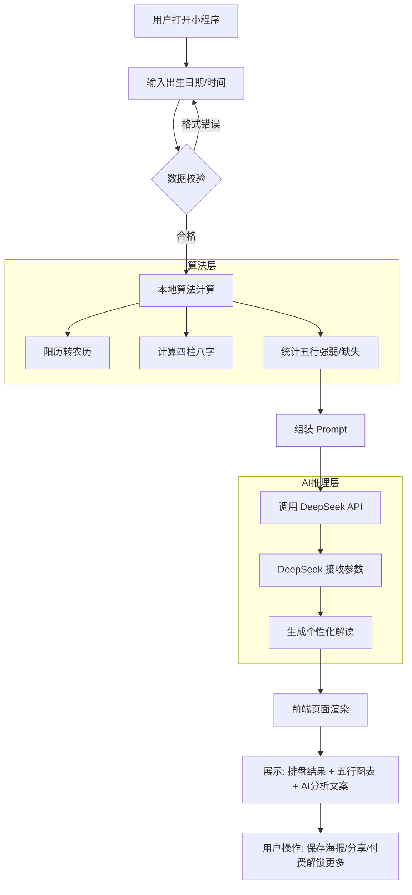

# 智能命理助手小程序需求分析报告 (MRD)

**文档版本**：V1.0  
**撰写日期**：2023-10  
**撰写人**：Product Manager  
**项目代号**：Project DeepDestiny

---

## 1. 产品概述 (Product Overview)

### 1.1 产品背景
随着“玄学经济”在年轻群体中的复兴，用户对于个人运势、性格分析的需求日益增长。传统的排盘软件界面复杂、术语晦涩，而线下咨询成本高昂。结合 DeepSeek 强大的自然语言推理能力，我们可以开发一款由 AI 驱动的智能命理助手，将原本生涩的数据转化为用户听得懂、有深度的建议。

### 1.2 核心功能
本产品是一款基于微信小程序的智能分析工具。用户输入阳历出生信息，系统首先通过标准算法进行精准的八字排盘（农历、干支、五行），随后将结构化数据投喂给 DeepSeek API，生成个性化的性格分析、五行补救建议及运势解读。

### 1.3 产品定位
- **工具属性**：精准的日历与八字计算器。
- **内容属性**：基于 AI 的个性化命理咨询师。
- **社交属性**：生成的精美报告便于微信生态内的分享与裂变。

---

## 2. 用户需求分析 (User Needs Analysis)

### 2.1 目标用户画像
1. **泛玄学爱好者 (18-35岁)**：对星座、MBTI、八字感兴趣，喜欢探索自我，乐于在社交媒体分享。
2. **迷茫期人群**：面临求职、婚恋、升学等人生路口，寻求心理慰藉和决策参考的用户。
3. **国学文化爱好者**：对传统天干地支、节气文化感兴趣的人群。

### 2.2 核心使用场景
- **场景一：自我探索**
  - 用户：想了解自己的五行缺什么，性格优劣势。
  - 行为：输入生日 -> 查看五行比例 -> 阅读 AI 生成的性格分析。
- **场景二：社交话题**
  - 用户：在聚会或聊天时，帮朋友算一下，或者分享自己的“AI 批命”结果到朋友圈。
- **场景三：具体解惑**
  - 用户：最近运气不好，想知道怎么通过穿衣颜色或饰品来“补五行”。

### 2.3 痛点与解决方案

| 用户痛点       | 传统方案缺陷                     | 本产品解决方案 (AI + DeepSeek)                          |
| :------------- | :------------------------------- | :------------------------------------------------------ |
| **看不懂**     | 满屏甲乙丙丁，全是专业术语，小白无法理解 | **AI 翻译**：DeepSeek 将术语转化为大白话，解释“缺火”意味着什么性格特点。 |
| **结果千篇一律** | 查表式生成的死板模版文案           | **千人千面**：DeepSeek 根据五行组合进行逻辑推理，生成具有“人情味”的分析。 |
| **咨询贵**     | 大师咨询动辄几百上千元             | **低成本**：API 调用成本低，可提供免费或低价服务。          |

---

## 3. 功能需求详解 (Functional Requirements)

### 3.1 输入模块
- **功能点**：日期与时间选择器。
- **字段**：
  - 姓名/昵称（可选，用于生成报告称呼）。
  - 性别（影响大运推算，MVP版本可暂不涉及大运，仅论原局）。
  - 出生日期（阳历 Year-Month-Day）。
  - 出生时间（精确到小时，提供“时辰不详”选项）。
- **交互**：支持直接选择阳历，前端自动校验日期有效性。

### 3.2 核心计算模块 (本地/后端算法)
- *注意：此部分不建议直接用 AI 算，AI 数学能力弱，需用代码算好传给 AI。*
- **日历转换**：调用 `lunar-javascript` 或类似库，将阳历转为农历。
- **八字排盘**：计算年柱、月柱、日柱、时柱（天干+地支）。
- **五行量化**：
  - 计算金、木、水、火、土的数量及强度。
  - 判断五行缺失（如：缺金）。
- **生肖判定**：基于立春节点的生肖计算。

### 3.3 DeepSeek AI 推理模块
- **API 交互机制**：
  - **输入 (Prompt)**：将上述计算出的结构化数据（如：“日主天干为甲木，五行缺金，火旺...”）封装成 Prompt。
  - **System Prompt 设定**：设定 AI 角色为“资深国学研究员”或“心理咨询师”，要求语气温和、客观、积极。
  - **输出**：Markdown 格式的文本分析。
- **推理内容**：
  - **性格侧写**：基于日主和五行强弱分析性格。
  - **五行建议**：针对缺失五行，给出颜色、方位、饰品建议。
  - **综合评语**：一段诗意的总结。

### 3.4 结果展示模块
- **视觉化图表**：五行占比雷达图或饼图。
- **关键信息卡片**：生肖、星座、八字排盘表。
- **AI 解读区**：流式输出（打字机效果）展示 DeepSeek 生成的文案。
- **分享生成**：生成一张包含关键信息 + 底部小程序码的精美海报。

---

## 4. 关键业务流程 (Business Process)

---

## 5. 开发周期计划 (Development Schedule)

建议采用敏捷开发，首个 MVP (Minimum Viable Product) 周期约为 3周。

Phase 1: MVP 核心版 (Week 1-2)  
目标：跑通流程，能算、能由 AI 说话。  
任务：  
搭建小程序基础框架 (Uni-app 或 原生)。  
集成 lunar 算法库，实现排盘功能。  
对接 DeepSeek API，调试 Prompt 效果。  
基础结果页展示（文本+简单图表）。

Phase 2: UI 优化与分享 (Week 3)  
目标：好看、好传。  
任务：  
UI 风格定调（建议新中式风格：水墨+极简）。  
五行图表可视化开发（ECharts）。  
Canvas 海报生成功能。

Phase 3: 商业化与高级功能 (Week 4+)  
目标：盈利。  
任务：  
接入微信流量主（激励视频广告）。  
增加“流年运势”高级测算（需更复杂的 Prompt 和 Token 消耗）。  
用户历史记录保存。

---

## 6. 商业模式 (Business Model)

6.1 免费基础版 (引流)  
内容：基础排盘（天干地支显示）、五行占比图、生肖查询。  
AI内容：简短的性格概括（约 100 字）。  
目的：降低门槛，获取用户，促进分享。

6.2 激励广告模式 (核心盈利)  
机制：用户观看 30 秒激励视频广告后，解锁“DeepSeek 深度详解报告”。  
解锁内容：详细的五行缺失补救指南、事业/情感方向建议（约 500-800 字）。

6.3 增值服务 (未来扩展)  
单次付费解锁：针对不愿意看广告的用户，提供 1.99 元 - 4.99 元的小额支付解锁。  
AI 问答：提供“向 AI 提问”的入口（例如：“我今年适合跳槽吗？”），按提问次数收费（消耗 Token 较多）。

---

## 7. 风险评估与合规 (Risk & Compliance)

### 平台合规风险：
- 微信小程序对“封建迷信”类目管控严格。  
  对策：产品文案必须包装为“传统文化科普”、“心理性格分析”或“娱乐工具”。避免使用“算命”、“预测未来”、“凶吉”等绝对化词汇。
- AI 的 Prompt 也要设定明确的边界，输出内容需积极向上，主打心理抚慰。

### API 成本与稳定性：
- 若用户量激增，API Token 费用会上升。  
  对策：前端做缓存（相同的生辰八字在一定时间内直接读取缓存，不重复调用 API）。
- 准确性争议：  
  用户可能质疑结果不准。  
  对策：底部增加免责声明，强调“内容由 AI 生成，仅供娱乐与文化研究，不作为决策依据”。